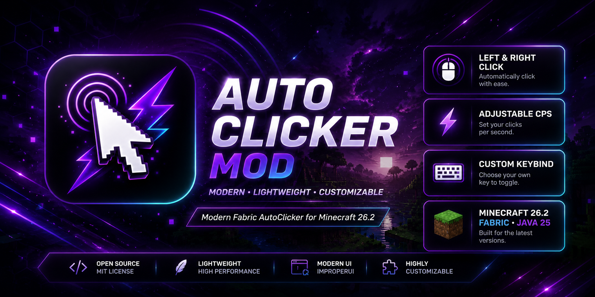

<div align="center">

# AutoClicker Mod

A modern, lightweight and highly customizable AutoClicker for Minecraft Java Edition.

Supports the latest Fabric ecosystem and provides a simple, clean and fast experience without unnecessary features.


</div>

---

# Banner

<p align="center">



</p>

---

# Features

- Modern AutoClicker
- Left Click AutoClicker
- Right Click AutoClicker
- Adjustable CPS
- Simple in-game GUI
- Custom Keybind
- Lightweight
- High Performance
- ImproperUI Interface
- Fabric API Support
- Minecraft 26.2 Support
- Java 25 Support

---

# Screenshots

<p align="center">


</p>

---

# Requirements

| Requirement | Version |
|------------|---------|
| Minecraft | 26.2 |
| Java | 25 |
| Fabric Loader | Latest |
| Fabric API | Latest |

---

# Installation

1. Install Java 25.
2. Install Fabric Loader for Minecraft 26.2.
3. Download the latest release.
4. Install Fabric API.
5. Put the mod into your `mods` folder.
6. Start Minecraft.

---

# Usage

1. Launch Minecraft.
2. Join a world.
3. Press the configured keybind to open the AutoClicker menu.
4. Configure the desired CPS and options.
5. Enable the AutoClicker.
6. Enjoy.

---

# Controls

| Action | Description |
|--------|-------------|
| Open Menu | Configurable Keybind |
| Left Click | Automatic clicking |
| Right Click | Automatic clicking |
| GUI | Configure settings |
| CPS | Adjustable |

---

# Compatibility

| Supported |
|------------|
| Singleplayer |
| Fabric |
| Java Edition |
| Minecraft 26.2 |

---

# Where you can use this mod

✔ Singleplayer

✔ Private Servers

✔ Creative Worlds

✔ Testing Worlds

✔ Development

✔ Local Multiplayer

---

# Where you should NOT use this mod

❌ Competitive Multiplayer Servers

❌ Servers where AutoClickers are prohibited

❌ Public servers with strict anti-cheat rules

Always respect the rules of the server you are playing on.

---

# Build from Source

Clone the repository.

```bash
git clone https://github.com/LucaMaximal/AutoClicker-Mod.git
cd AutoClicker-Mod
```

Build the project.

```bash
./gradlew build
```

The compiled mod will be located in:

```text
build/libs/
```

---

# Downloads

Download the latest version from the **GitHub Releases** page.

---

# Dependencies

- Fabric Loader
- Fabric API
- ImproperUI

---

# Roadmap

- Improved GUI
- Additional customization
- More clicking modes
- More configuration options
- Performance improvements
- Additional quality-of-life features

---

# Contributing

Contributions, suggestions and bug reports are welcome.

Please open an Issue or Pull Request before making major changes.

---

# Bug Reports

If you encounter a bug, please include:

- Minecraft Version
- Fabric Loader Version
- Fabric API Version
- Mod Version
- Crash Log (if available)
- Steps to reproduce

---

# Credits

Developed by **LucaMaximal**

Special thanks to:

- FabricMC
- ImproperUI

---

# License

This project is licensed under the license included in this repository.

Please read the LICENSE file before using or redistributing this project.

---

<div align="center">

Made with ❤️ for the Minecraft Fabric Community.

</div>
